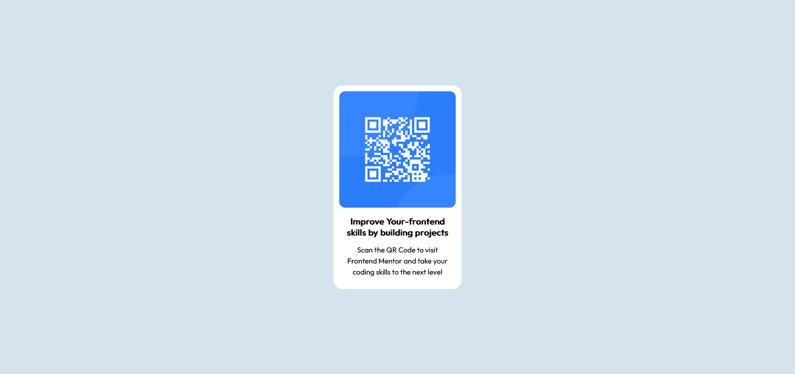

# Frontend Mentor - QR code component solution

This is a solution to the [QR code component challenge on Frontend Mentor](https://www.frontendmentor.io/challenges/qr-code-component-iux_sIO_H). Frontend Mentor challenges help you improve your coding skills by building realistic projects. 

## Table of contents

- [Overview](#overview)
  - [Screenshot](#screenshot)
  - [Built with](#built-with)
  - [What I learned](#what-i-learned)
  - [Continued development](#continued-development)
- [Author](#author)
- [Acknowledgments](#acknowledgments)


## Overview

### Screenshot




## My process

### Built with

- Semantic HTML5 markup
- CSS custom properties
- Flexbox


### What I learned


```html
<h1>Some HTML code I'm proud of</h1>
```
```css
.proud-of-this-css {
  color: #D5E3ED;
}
```


### Continued development

I will still want to know more about the usage of FLEX and improve on my CSS


## Author

- Website - [Ligali Oluwatosin](https://www.your-site.com)
- Frontend Mentor - [@jcsonvonyon](https://www.frontendmentor.io/profile/jcsonvonyon)
- Twitter - [@tosinligali](https://www.twitter.com/tosinligali)


## Acknowledgments

I would like to acknowledge W3schools.com for the great examples, i picked alot of ideas there

